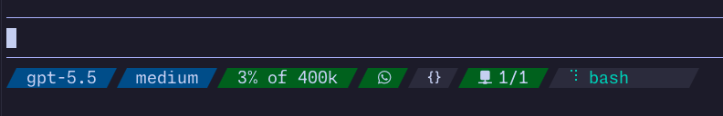

# pi-bar

Configurable [pi](https://pi.dev) status bar extension.



## Install

```sh
pi install npm:@npm-ken/pi-bar
```

pi-bar works immediately after install using the bundled default config.

## Customize

Create this file and edit it:

```text
~/.pi/pi-bar/config.toml
```

To start from the default config, copy `config.toml` from this repository or from the installed npm package and paste it to ~/.pi/pi-bar/config.toml

## Common edits

### Colors

```toml
[colors]
text_fg = "#cdd6f4"
model_bg = "#005b95"
thinking_bg = "#005b95"
activity_bg = "#313244"
activity_fg = "#2dd4bf"
ok = "#006b1d"
warn = "#a17a00"
alert = "#972e2d"
```

Use `#rrggbb` hex colors. Segments use these names with `fg` and `bg`.

### Separators

Powerline/Nerd Font separators:

```toml
[statusbar.separators]
leading = "\uE0BA"
trailing = "\uE0BC"
```

Plain separators:

```toml
[statusbar.separators]
leading = ""
trailing = ""
```

### Segments

Segments are listed as `[[statusbar.segments]]`. Reorder, remove, or add them in
that file.

```toml
[[statusbar.segments]]
type = "value"
template = "{model}"
empty_text = "no model"
fg = "text_fg"
bg = "model_bg"
```

Segment types:

- `value` — text from `template`
- `meter` — numeric value with threshold colors
- `dir` — current working directory
- `status` — pi extension status, like MCP or LSP
- `activity` — tool activity / working spinner

`template` replaces `{tokens}` with values for that segment type. Tokens are scoped per type, so `{value}` in a `meter` segment is not the same as `{value}` in an `activity` segment.

Template tokens:

- `value`: `{value}` / `{model}` = full model id or `empty_text`, `{short_model}` = model id after the final `/`, `{thinking}` = current thinking level.
- `dir`: `{value}` / `{dir}` = current directory name, `{path}` = full current working directory.
- `git`: `{remote_icon}` = remote service icon, `{branch_icon}` = branch icon, `{branch}` = current branch, `{staged}` / `{unstaged}` = dirty booleans, `{ahead}` / `{behind}` = upstream counts, `{service}` = remote service, `{service_icon}` = default remote service icon, `{remote}` = origin URL. Set `icons = { remote = "...", branch = "..." }` on a git segment to override icons. Git `states` support `id = "unstaged"`, `id = "staged"`, `id = "ahead"`, and `id = "behind"` with `fg`/`bg` colors. The segment `bg` is used when no state matches.
- `meter`: `{value}` = raw numeric meter value, `{percent}` = rounded value, `{context_window}` = human-readable model context window.
- `status`: `{value}` / `{text}` = normalized status text, `{key}` = status key, plus numeric tokens parsed from status text such as `{errors}` or `{warnings}`. MCP statuses also expose `{servers}` for the `connected/total` count.
- `activity`: `{source}` = `tools` or `streaming`, `{spinner}` = current spinner frame, `{tools}` = comma-separated tool names, `{streaming}` = streaming state, `{value}` = source display value.

`eval`, `collapsed_eval`, and state-level `eval` still work for backwards compatibility. Prefer `template` and `collapsed_template` for new configs.

Status segments can set `ignore = ["regex"]` to skip matching status text. This is useful on `key = "*"` catch-all segments when a known status should not be rendered.

### Adaptive / Responsive Collapsing

pi-bar supports optional configuration attributes to gracefully scale down the status bar on constrained terminal widths instead of truncating abruptly:

- A segment is eligible for collapse when it sets `collapse_order`, `collapsed_template`, or `collapsed_eval`.
- `collapse_order`: integer group number for responsive collapse order. `1` is the first group collapsed; higher groups are kept longer.
- `collapsed_template`: alternative template rendered when the segment is collapsed. When `collapsed_template` is set without `collapse_order`, the segment collapses with order `1`.
- If `collapse_order` is set without `collapsed_template` or `collapsed_eval`, the segment is hidden when its collapse order comes up.

#### Example Config

```toml
# A later-collapsing context utilization meter that collapses to a shorter format
[[statusbar.segments]]
type = "meter"
value_eval = "ctx.getContextUsage()?.percent ?? 0"
template = "{percent}% of {context_window}"
fg = "text_fg"
collapse_order = 4
collapsed_template = "{percent}%"

# An early-collapsing thinking indicator that hides entirely when space is limited
[[statusbar.segments]]
type = "value"
template = "{thinking}"
show_if = "model?.reasoning"
fg = "text_fg"
bg = "thinking_bg"
collapse_order = 2

# A first-collapsing status segment can omit collapse_order when collapsed_eval is present
[[statusbar.segments]]
type = "status"
key = "whatsapp"
template = "  "
fg = "text_fg"
collapsed_template = " WA "

# A last-collapsing active tool spinner that collapses to just the spinner glyph
[[statusbar.segments]]
type = "activity"
fg = "activity_fg"
bg = "activity_bg"
min_width = 11
template = "{spinner} {value}"
collapsed_template = "{spinner}"
collapse_order = 5
```


